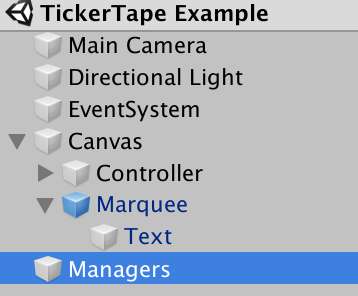

* Table of Contents
{:toc}
> Read the code in the Examples Folder.

# Executive Summary

Marquee is a simple Unity3D package to display a single line of text scrolling across the bottom of the game display. It is a useful technique for displaying hints, news or distractions without pausing the game. You can supply it with lists of items in one or more text files. RTF is supported as well as a simple technique to separate quotes from attributions.

# Introduction

A marquee is a canopy over the entrance to a theatre among other buildings. The marquee commonly displayed news about the shows.

In this incarnation, a `Marquee` is a scrolling text asset for a UI component. It is a `Scroller` (see the Able package) inside a MonoBehaviour.

`Tickertape` is a manager custom asset that serves items to the marquee It takes a list of items from the asset and one or more text files and display lines from them randomly. There are overrides for important and immediate messages.

# Installation

Given that most games and apps only have one Marquee, it is probably easiest to take a copy of the ***Assets/Askowl/Marquee*** directory and modify the custom assets to suite your requirements. Simply drag the Marquee prefab into a canvas in your hierarchy.



Also drop the ***Managers*** prefab into your project or update your existing ***Managers*** instance adding the ***Tickertape*** manager.


Tuning is now done by adjusting contents in custom assets, starting with ***Tickertape***.


# Marquee

A `Marquee` instance has one task - to scroll text from right to left across a viewport. It is designed to be attached to a `GameObject` within a canvas.

* Scene - that is to display the Marquee
  * Canvas - to hold 2D objects
  * GameObject - for the Marquee
    * Rect Transform - sized as the viewport
    * Rect Mask 2D - so Marquee text does not display outside the viewport
    * Marquee Instance - or a class that inherits from it
    * Characters per second (defaults to 20)
    * Repeats (defaults to 0)

Call `Marquee.Show(text)` and the text will be displayed immediately. To display once the current item is finished, use `Tickertape.NextItem(text)` instead. If message queue up there is no guarantee of order that they will appear. Use either to interrupt a stream of messages to show one of more immediate importance - such as breaking news.

```c#
[SerializedFiend] TickerTape tickertape = default;
// ...
tickertape.Show("A message that displays immediately");
tickertape.NextImte("A message displayed after current message is done");
```

The example also shows a use for `Hide()`. It will wait for the current text to complete, aborting any repeats. If you want the repeats to complete as well, change the `foreach` body to:

```c#
  marquee.Show(message);
  yield return marquee.Hide();
```

# Tickertape
The `Tickertape` prefab is in Assets/Askowl-Marquee/Marquee.
Drag it to your scene canvas. Add references to one or more text assets where each file includes single-line quotes, hints or messages. Check the `RectTransfor` to make sure the Left, Right, Pos Z, Top and Bottom fields are all 0.

# Manual Intervention

Uncheck the ***Auto Start*** box if you don't want to see messages as soon as your scene loads. Get a reference to the component that is the ticker tape by whatever means.

To start showing items, call `Show()`. You can cease displaying any time by disabling the game object or calling `Stop()`.

# Injecting a Special Message
To display a message, use `Show`. Once the current text completes its path across the screen, your message will start. Afterwards, the random quotes and hints will begin again.

# Adding Message Sources
If you want to add more sources of hints, quotes or jokes, `Add` provides three approaches.

```c#
Add(params TextAsset[]);
Add(params string[] TextAssetNames);
Add(string name, Pick<string> picker);
```

Use the last interface to add a list of quotes created with `Select<string>`. Alternatively, use `AssetSelect<string>` and save messages in the asset on disk ready to load with `AssetSelect<string>.Asset(name)`.
