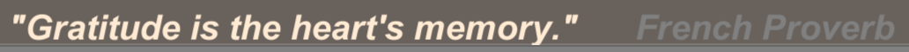

* Table of Contents
{:toc}
> Read the code in the Examples Folder.
>
> The Doxygen pages [here](https://paulmarrington.github.io/Unity-Documentation/Marquee/Doxygen/html/annotated.html)

# Executive Summary

Marquee is a simple Unity3D package to display a single line of text scrolling across the bottom of the game display. It is a useful technique for displaying hints, news or distractions without pausing the game. You can supply it with lists of items in one or more text files. RTF is supported as well as a simple technique to separate quotes from attributions.

# Introduction

A marquee is a canopy over the entrance to a theatre among other buildings. The marquee commonly displayed news about the shows.

In this incarnation, a `Marquee` is a scrolling text asset for a UI component. It is a `Scroller` (see the Able package) inside a MonoBehaviour.

`Tickertape` is a manager custom asset that serves items to the marquee. It takes a list of messages from the asset and one or more text files and display lines from them randomly. There are overrides for urgent and immediate messages.


# Videos

* [How to Build a Marquee](https://youtu.be/TVsNg6COdeI)

# Installation

Askowl Marquee comes with a wizard. It is in the ***Asset // Create*** menu, adding it to the current scene. The only additional work you will need to do is to add static messages and code to inject dynamic ones.

The wizard adds ***Marquee Canvas*** to the current scene. Change location, size and text look. Switch to TextMesh Pro by replacing the text component. Leave the `Textual` element as it acts as a universal communicator.

Tune by adjusting contents in custom assets, starting with ***Tickertape***. Most importantly, add quotes either directly or by `TextAsset`. If you only want to show dynamic content, such as a news feed, there may be no need for any static content.

 

***Able*** provides a property drawer that allows the viewing and editing of custom asset references. Contents (Quotes), Now Showing and Display Complete are three such custom assets. The latter two provided a decoupled interface with the Marquee MonoBehaviour.

## Auto Start
If your information is context specific, then it would be usual to disable auto-start. To start a display, have a reference to the Tickertape custom asset and call ***Show***, ***ShowNext*** or ***ShowImmediate*** as documented below.

## Seconds Between Feeds
In the current implementation, each item is on the screen alone, with the following one displaying once the predecessor has disappeared.

## Quotes
***Quotes*** Is a custom asset with quotes ready to display either embedded in it or one or more text files. See the CustomAsset documentation for more details. You can replace or supplement this list during play with ***Clear*** and ***Add***.

Each line becomes one displayed item if the line ends in an attribution within brackets it is formatted differently.

> Gratitude is the heart's memory (French Proverb)

becomes

 

## Now Showing
***Now Showing*** Is a string custom asset containing the text currently displayed. A change causes a restart with the words appearing on the right.

``` c#
// Set in the inspector to the Marquee "Now Showing" String CustomAsset.
[SerializeField] private String showing = default;
//...
void News(string text) => showing.Value = text;
```


## Showing Complete
A trigger custom asset that fires when the current text has left the screen.  Use with ***Now Showing*** to drive the Marquee directly for more control of what is displayed when.

## Additional Tuning Parameters
There are additional custom assets that you can edit from the ***Assets/Askowl/Marquee*** directory.

### Characters per second
This numeric value will control how fast the text scrolls across the screen. An amount of 16 will provide a slow read, while 100 is only readable to the quick of comprehension. You could change the speed to give a sense of urgency.

### Repeats per message
I am not sure why I added this one. Set to zero, so we see a message once.

## Actions from Tickertape Manager Custom Asset
### Show
Start displaying items.

### Stop
Don't display any more items after the current one is complete. Disable
the component if you want an immediate cessation.

### ShowNext
Display the provided text after the current item is complete.

### ShowImmediate
Drop the current display and show the provided message immediately

### Clear
Remove all `Quote` custom asset being used to generate messages to display

### Add
Add a `Quote` custom asset to the items that can be displayed.
